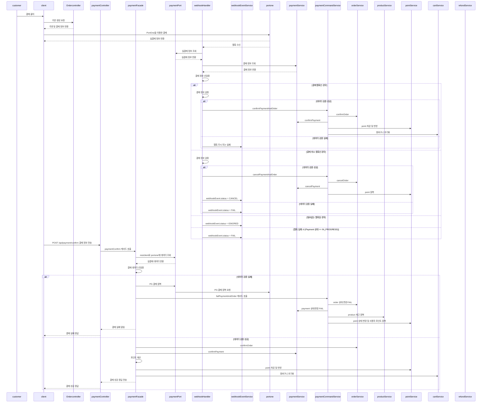

```mermaid
sequenceDiagram
    participant customer
    participant client
    participant Ordercontroller
    participant paymentController
    participant paymentFacade
    participant paymentPort
    participant webhookHandler
    participant webhookEventService
    participant portone
    participant paymentService
    participant paymentCommandService
    participant orderService
    participant productService
    participant pointService
    participant cartService
    participant refundService

    %% 1. 주문 생성 및 결제 진행
    customer->>client: 결제 클릭
    client->>Ordercontroller: 주문 생성 요청
    Ordercontroller-->>client: 주문 및 결제 정보 반환
    client->>portone: PortOne을 이용한 결제
    portone-->>client: 실결제 정보 반환

    %% 2. 웹훅(Webhook) 처리 흐름
    portone-->>webhookHandler: 웹훅 수신
    webhookHandler->>paymentPort: 실결제 정보 조회
    paymentPort-->>webhookHandler: 실결제 정보 반환
    webhookHandler->>paymentService: 결제 정보 조회
    paymentService-->>webhookHandler: 결제 정보 반환
    webhookHandler->>webhookHandler: 결제 정보 선검증

    alt 결제 웹훅인 경우
        webhookHandler->>webhookHandler: 결제 정보 검증
        alt 데이터 검증 성공
            webhookHandler->>paymentCommandService: confirmPaymentAndOrder
            paymentCommandService->>orderService: confirmOrder
            paymentCommandService->>paymentService: confirmPayment
            paymentCommandService->>pointService: point 차감 및 반영
            paymentCommandService->>cartService: 장바구니 초기화
        else 데이터 검증 실패
            webhookHandler->>webhookEventService: 웹훅 무시 또는 실패
        end
    else 결제 취소 웹훅인 경우
        webhookHandler->>webhookHandler: 결제 정보 검증
        alt 데이터 검증 성공
            webhookHandler->>paymentCommandService: cancelPaymentAndOrder
            paymentCommandService->>orderService: cancelOrder
            paymentCommandService->>paymentService: cancelPayment
            paymentCommandService->>pointService: point 원복
            webhookHandler->>webhookEventService: webhookEvent.status = CANCEL
        else 데이터 검증 실패
            webhookHandler->>webhookEventService: webhookEvent.status = FAIL
        end
    else 필요없는 웹훅일 경우
        webhookHandler->>webhookEventService: webhookEvent.status = IGNORED
    else 웹훅 실패 시 (Payment 상태 == IN_PROGRESS)
        webhookHandler->>webhookEventService: webhookEvent.status = FAIL
    end

    %% 3. 클라이언트 직접 승인 요청 흐름 (포트원 처리 후 폴백/직접 승인)
    client->>paymentController: POST /api/payment/confirm 결제 정보 전송
    paymentController->>paymentFacade: paymentConfirm 메서드 호출
    paymentFacade->>paymentPort: restclient로 portone에 데이터 조회
    paymentPort-->>paymentFacade: 실결제 데이터 반환
    paymentFacade->>paymentFacade: 결제 데이터 선검증

    alt 데이터 검증 실패
        paymentFacade->>paymentPort: PG 결제 원복
        paymentPort->>portone: PG 결제 원복 요청
        paymentFacade->>paymentCommandService: failPaymentAndOrder 메서드 호출
        paymentCommandService->>orderService: order 상태 변경 FAIL
        paymentCommandService->>paymentService: payment 상태 변경 FAIL
        paymentCommandService->>productService: product 재고 원복
        paymentCommandService->>pointService: point 상태 변경 및 사용자 포인트 원복
        paymentFacade-->>paymentController: 결제 실패 알림
        paymentController-->>client: 결제 실패 응답
    else 데이터 검증 성공
        paymentFacade->>orderService: confirmOrder
        paymentFacade->>paymentService: confirmPayment
        paymentFacade->>paymentFacade: 포인트 계산
        paymentFacade->>pointService: point 차감 및 반영
        paymentFacade->>cartService: 장바구니 초기화
        paymentFacade-->>paymentController: 결제 성공 응답 전송
        paymentController-->>client: 결제 성공 응답
    end
```